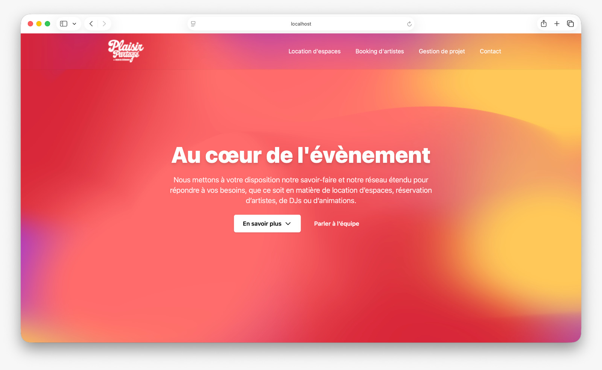

# Plaisir partage

[](https://docs.docker.com/compose/)
[](https://www.python.org/downloads/release/python-3120/)
[](https://flask.palletsprojects.com/)
[](https://nginx.org/)

Site statique pour Plaisir partage (frontend HTML/JS + backend Flask pour l'envoi des formulaires) emballes dans Docker Compose.



## Prerequis
- Docker et Docker Compose v2
- Optionnel pour le developpement hors conteneur: Python 3.12+ et `pip`

## Demarrage rapide avec Docker
1) Placer les sources dans `src/` (structure actuelle du repo).
2) Creer un fichier `src/.env` pour les emails et Traefik (exemple ci-dessous). Sans configuration SMTP, les formulaires renverront une erreur 500.
3) Depuis `src/`, lancer:
   ```bash
   docker compose up --build
   ```
4) Frontend disponible sur http://localhost:8080 et backend Flask sur http://localhost:5000 (expose uniquement dans le reseau Compose).

Exemple de fichier `src/.env`:
```env
APP_DOMAIN=recette.exemple.com
TRAEFIK_ACME_EMAIL=admin@exemple.com
SMTP_HOST=ssl0.ovh.net
SMTP_PORT=465
SMTP_USER=postmaster@plaisirpartage.agency
SMTP_PASSWORD=*****
SMTP_FROM=postmaster@plaisirpartage.agency
SMTP_TO=destinataire@exemple.com
SMTP_STARTTLS=true
```

## Mise en recette sur VPS OVH (Traefik)
1) Creer un enregistrement DNS `A` pour votre domaine de recette vers l'IP du VPS.
2) Renseigner `APP_DOMAIN` et `TRAEFIK_ACME_EMAIL` dans `src/.env`.
3) Creer le fichier ACME pour LetsEncrypt:
   ```bash
   cd src
   touch traefik/acme.json
   chmod 600 traefik/acme.json
   ```
4) Lancer la stack recette:
   ```bash
   docker compose up -d --build
   ```
5) Verifier que les ports 80/443 sont ouverts sur le VPS (pare-feu OVH inclus).

## Developpement sans Docker
- Backend Flask:
  ```bash
  cd src/backend
  python -m venv .venv
  source .venv/bin/activate
  pip install -r requirements.txt
  export FLASK_APP=app.py  # ou utiliser les variables SMTP ci-dessus
  gunicorn -b 0.0.0.0:5000 app:app
  ```
- Frontend statique: depuis `src/frontend`, servir les fichiers avec l'outil de votre choix, par exemple `python -m http.server 8080`. Mettre a jour les appels API pour cibler l'URL du backend si besoin.
